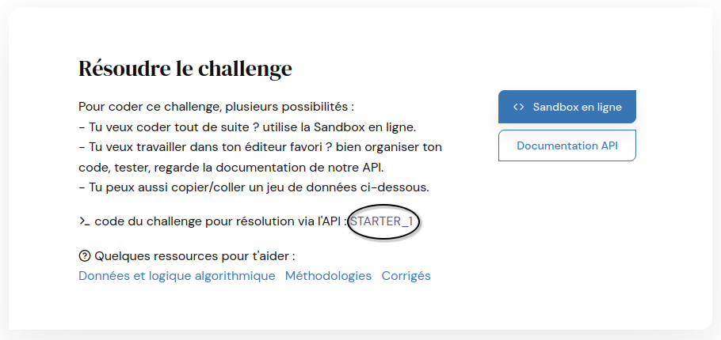
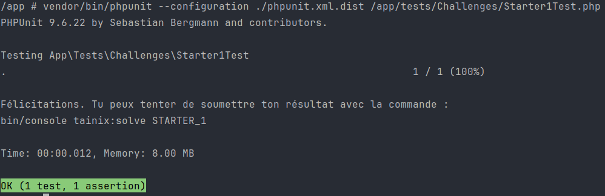
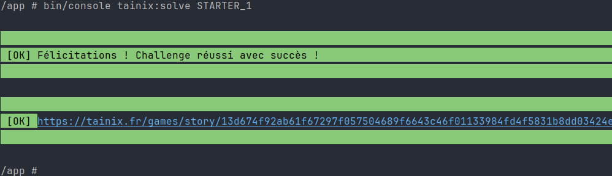

# Tainix Console App

## prerequisites

 * make
 * docker
 * docker compose

## Build docker image

```shell
make build
```

## Configure your Tainix key

```shell
echo 'TAINIX_KEY=xxxxxxxxxxxxxxxxxx' > .env.dev.local
```

## Enter the container

```shell
make sh
```

# Challenges

## Start a Challenge (while in container)

```shell
bin/console make:tainix:challenge
```

The challenge code will be prompted.

Code can ce found at the bottom of a challenge page.



This command will generate 5 files.

```shell
bin/console make:tainix:challenge

 Choose a challenge code (e.g. PIERRE_FEUILLE_CISEAUX):
 > STARTER_1

 created: src/Challenges/STARTER_1/Challenge.php
 created: src/Challenges/STARTER_1/Tainix/Input.php
 created: src/Challenges/STARTER_1/Tainix/Sample.php
 created: src/Challenges/STARTER_1/Tainix/Game.php
 created: tests/Challenges/Starter1Test.php
```

You will only have to code in `Challenge.php`

## Test a Challenge

A `TestCase` is created in the `tests/Challenges` directory.

You can run it to test your code against a sample data.

```shell
vendor/bin/phpunit --configuration ./phpunit.xml.dist /app/tests/Challenges/Starter1Test.php
```



## Submit a Challenge

Once the `TestCase` is green, you can submit your answer, generated from personnal game data and token.

```shell
bin/console tainix:solve STARTER_1
```



# Happy Tainix !
